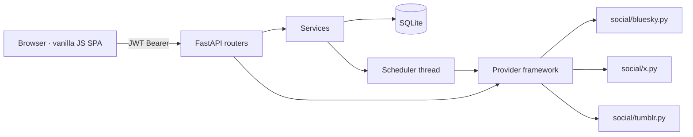
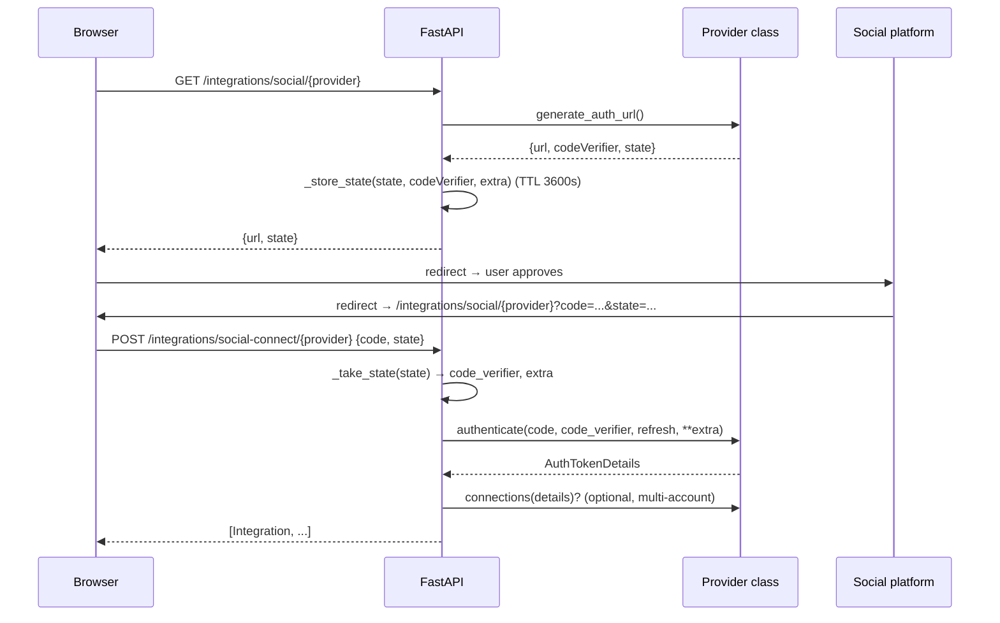
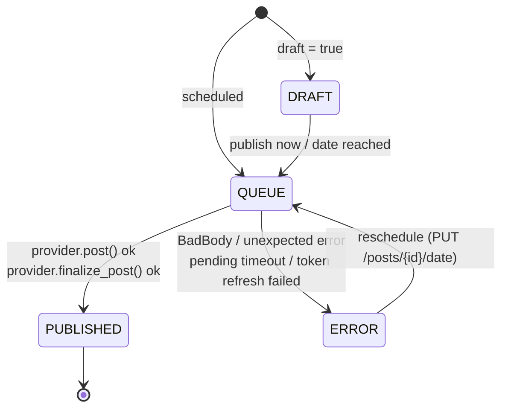
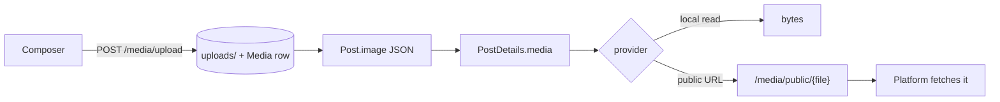
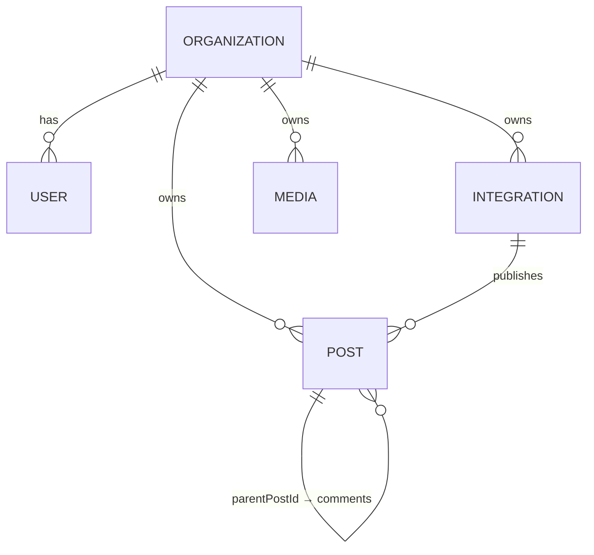

# Architecture

Postiz Python is a **single-process application**: one FastAPI server, one SQLite file, one
background thread. Everything that upstream Postiz spreads across Next.js, NestJS, Prisma,
Redis and Temporal is folded into a few hundred lines of readable Python.

This document explains the moving parts, the lifecycles of a post, and the decisions behind them.

---

## 1. Layer map

| Layer | Location | Responsibility |
|---|---|---|
| HTTP API | `app/api/` | Routers: `auth`, `integrations`, `posts`, `media`. Validate input, enforce org scope, translate provider errors to HTTP. |
| Core | `app/core/` | `config.py` (pydantic-settings, `.env`), `security.py` (JWT + bcrypt). |
| Persistence | `app/db/` | SQLAlchemy models (`Organization`, `User`, `Integration`, `Post`, `Media`, `ErrorRecord`) and engine/session factory. |
| Provider framework | `app/integrations/` | `base.py` (contract, errors, HTTP client, helpers), `interfaces.py` (dataclasses), `media.py` (media helpers), `social/` (one module per platform). |
| Services | `app/services/` | `integration_service.py` (connect + refresh), `posts_service.py` (state transitions), `scheduler.py` (background loop). |
| Frontend | `app/static/` | `index.html` + `app.js` + `style.css`, vanilla, no build step, served by FastAPI with SPA fallback. |
| Tests | `tests/` | Two flat scripts, 61 assertions-driven tests, no pytest. |



---

## 2. Startup sequence

`app/main.py`:

1. `init_db()` — create tables if missing (SQLite auto-creates).
2. `mkdir` the upload directory.
3. `start_scheduler()` — daemon thread named `postiz-scheduler`.
4. Mount `/static` and register a SPA fallback: any unknown path returns `index.html`
   (so `/integrations/social/x` — the OAuth redirect target — works on page load).
5. `GET /api/health` → `{"status": "ok"}`.

---

## 3. Connecting a platform

### 3.1 OAuth 2.0 flow



Key points:

- **State lives in memory** (`_state_store`, TTL 1 hour). One process ⇒ no Redis.
- `generate_auth_url` may return `{"url": state}` for providers that have no real OAuth URL —
  the frontend then goes straight to the callback path.
- `connections(details)` lets a single login spawn several channels:
  - **Facebook** → one integration per Page,
  - **Instagram** → one per professional account,
  - **Tumblr** → one per blog (each blog keeps its own `internalId`).
- Re-connection (`?refresh=1`) re-uses the same state machinery with a provider-specific
  redirect URI suffix where the platform requires it (Kick, Twitch, Threads, TikTok).

### 3.2 Credentials flow (`credentials = True`)

For platforms without an OAuth app (Medium, Bluesky, Telegram) or with application passwords:

1. The frontend opens a modal built from `customFields()` (`key`, `label`, `type`, `validation`, `hint`).
2. Values are base64-encoded and sent as `code` to the same `/social-connect/{provider}` endpoint.
3. `authenticate()` decodes, calls the platform, and returns the usual `AuthTokenDetails`.

No state entry is consumed — `state` is sent empty.

---

## 4. Publishing a post

### 4.1 Creating posts

`POST /posts` accepts a batch — one entry per channel, optionally sharing a `group` id:

```json
{ "posts": [ { "integrationId": "…", "content": "…", "publishDate": "2026-10-10T09:00:00",
               "image": [{"path": "a.png", "type": "image"}], "settings": {}, "group": "g1" } ] }
```

Each row becomes a `Post` in state **`QUEUE`** (or `DRAFT` when `draft: true`).
Rows with `parentPostId` are **comments**: they inherit the group and are published by
`comment_post()` after their parent exists.

### 4.2 State machine



Asynchronous uploads (LinkedIn, X, YouTube, TikTok, Facebook, Instagram, Mastodon, Pinterest,
Reddit, Threads, Bluesky) keep the row in `QUEUE` but mark it with a **`pendingData`** payload —
that is the "pending" phase upstream Postiz models with Temporal.

### 4.3 The three-phase handshake

```
post_pending(...)  ──► PostResponse{status:"pending", pendingData:{…}}
        │                state stays QUEUE, pendingData persisted, pendingChecks = 0
        ▼
check_post_status(...)   polled every PENDING_CHECK_INTERVAL_SECONDS
        │
        ├── status "pending"   → keep waiting (pendingChecks++)
        ├── status "failed"    → mark ERROR (message from provider)
        ├── status "completed" → mark PUBLISHED   ← duplicate guard: a post that was already
        │                                             confirmed upstream is never re-published
        └── status "ready"     → finalize_post(...)
                    │
                    ├── status "completed" → mark PUBLISHED
                    └── otherwise          → stay pending, wait for the next poll
```

Guard rails:

- `PENDING_MAX_CHECKS` (default 90) × `PENDING_CHECK_INTERVAL_SECONDS` (20 s) ≈ **30 minutes**
  before a pending post is marked `ERROR: Pending post timed out`.
- `pendingData` is merged (`_merge_pending`) so providers can keep their own keys intact.
- A **preparation failure** (media validation) can leave the handshake *armed*: the next tick
  retries `post_pending`, and Bluesky counts `prepFailures` so that a bad payload is reported
  instead of silently re-uploading.

### 4.4 Duplicate guard (arm / confirm)

Several platforms answer "nothing happened" ambiguously when a request times out. Providers such
as Bluesky and X keep an `armed` flag inside `pendingData`:

- first pass → attempt creation; if the API says *rejected*, report `BadBody`;
- if creation answers **5xx**, the post stays armed → the next check re-reads the platform state
  ("may already have published") instead of publishing twice.

### 4.5 Comments

`comment_post()` runs for rows with `parentPostId`:

```python
provider.comment(internalId, token, details[0], parent.releaseId, integration)
```

`parent.releaseId` is the remote id of the parent post (message id, post id, thread id…), which
the provider uses as `reply_to` / `reply_parent_message_id` / root-uri. On
`RefreshTokenError` the scheduler refreshes and retries once.

### 4.6 The scheduler loop

```python
while True:
    _scheduler_tick()          # see below
    time.sleep(SCHEDULER_INTERVAL_SECONDS)   # default 10
```

Each tick:

1. Select due parents: `state == "QUEUE" AND publishDate <= now AND parentPostId IS NULL AND pendingData IS NULL`
2. Select pending rows: `pendingData IS NOT NULL`
3. Select due comments: `parentPostId IS NOT NULL AND publishDate <= now`
4. Publish due posts (serialized by `_pending_lock`)
5. Resolve pending rows, then sleep `PENDING_CHECK_INTERVAL_SECONDS` if any existed
6. Publish comments
7. `refresh_due_tokens()`

The loop is intentionally **single-threaded and serialized by a lock**: a post is published by
exactly one worker at a time, which makes the duplicate guard trivial to reason about.

---

## 5. Token refresh

```python
needs_refresh(integration)      # False when refreshToken == ""
                                # True when tokenExpiration - now < REFRESH_MARGIN_SECONDS (300s)
refresh_integration(db, integration)
```

`refresh_integration()` is deliberately written to be **re-entrant and non-destructive**:

1. call `provider.refresh_token(old_refresh)`;
2. if the provider returns an empty access token → `refreshNeeded = True`, return `False`;
3. otherwise **update the row in place** (same `id`), recompute `tokenExpiration`,
   clear `refreshNeeded`, and persist `additionalSettings`;
4. **synchronize siblings**: every integration in the organization sharing the *old* refresh
   token receives the new token — required by **Tumblr**, where one login creates one row per
   blog with a shared token, and harmless for everyone else.

Triggers:

- **eager** — inside `publish_post()` before the API call;
- **reactive** — on `RefreshTokenError` raised by any provider call: refresh, then retry once;
- **background** — `refresh_due_tokens()` each tick.

If refresh fails, the post is marked `ERROR` with *"Token refresh failed, reconnect required"*
and the integration shows the reconnect banner in the UI.

---

## 6. Error taxonomy

| Exception | Raised when | Scheduler reaction |
|---|---|---|
| `BadBody` | Permanent, payload-level rejection (4xx, validation, platform said no) | `state = ERROR` + message |
| `RefreshTokenError` | Access token expired / revoked | refresh + retry once, else ERROR |
| `Disconnect` | Integration must be reconnected | `refreshNeeded = True`, ERROR |
| `NotEnoughScopes` | Granted scopes < required scopes | HTTP 409 with missing scopes (connect flow) |
| Any other exception | Bug or unexpected upstream behaviour | `ERROR: Unexpected error …` |

Constructor shape (kept from upstream for readability):

```python
BadBody(identifier, json_body, "{}", human_message)
# → exc.message = human_message   (extra[-1])
```

Provider-specific classification goes through `handle_errors(body, status)`, which the shared
HTTP client calls **only for status ≥ 400**; providers may inspect bodies returned with HTTP 200
themselves (VK does exactly that: `{error: …}` with status 200).

---

## 7. HTTP client

`SocialAbstract.fetch()` in `app/integrations/base.py`:

- retries **429 / 500 / 502 / 503 / 504** up to `MAX_RETRIES = 3` times with `BACKOFF_SECONDS = 5`;
- never raises for 2xx/3xx;
- delegates errors to `handle_errors()` (see above);
- supports `method`, `headers`, `params`, `data` (form), `json`, `files` (multipart), `auth`;
- `get_json()` / `get_text()` are thin wrappers.

Helpers every provider may use: `encode_component()` (RFC 3986, `encodeURIComponent`-like),
`pkce_challenge()`, `is_public_url()` (SSRF guard for user-supplied hosts), `slugify()`.

---

## 8. Media pipeline



- Allowed: `png/jpg/gif/webp` and `mp4/mov/webm`, up to **100 MB**.
- `public_url(path)` turns a stored filename into
  `{BACKEND_URL}/media/public/{file}` — the URL platforms themselves fetch
  (and it is only served if a `Media` row exists, so random names cannot be enumerated blindly).
- `read_or_fetch()` accepts either a local filename or a full `http(s)` URL.
- `image_dimensions()`, `media_size()`, `media_chunk()` (Range reads) and `prepare_image_buffer()`
  support the platform-specific limits (LinkedIn/X/YouTube chunked uploads, Bluesky's 976 KB
  image cap, Tumblr block dimensions…).

---

## 9. Data model



| Table | Purpose | Notable columns |
|---|---|---|
| `organization` | Tenant boundary; every query is scoped by it | `apiKey` |
| `user` | Login account | `email` (unique), `password` (bcrypt), `organizationId` |
| `integration` | One connected channel | `providerIdentifier`, `internalId` (remote id), `token`, `refreshToken`, `tokenExpiration`, `additionalSettings` (JSON, e.g. Reddit username), `refreshNeeded`, `disabled`, `inBetweenSteps` |
| `post` | One row per channel | `state`, `publishDate`, `content`, `image` (JSON), `settings` (JSON), `group`, `parentPostId`, `delay`, `releaseId`, `releaseURL`, `error`, `pendingData`, `pendingChecks` |
| `media` | Uploaded asset | `path`, `type`, `fileSize`, `alt` |
| `error_record` | Platform error log | `platform`, `message`, `body` |

Serializers deliberately **hide secrets**: `serialize_integration()` never returns `token`,
`refreshToken` or `additionalSettings`.

---

## 10. Security notes

- **Passwords**: bcrypt hashes; minimum 8 characters at registration.
- **Sessions**: JWT (HS256, `JWT_EXPIRATION_DAYS` default 7) in `Authorization: Bearer`.
- **Tenant isolation**: every router loads the row *and* checks `organizationId` matches the caller.
- **OAuth state**: random, single-use, TTL 1 h, stored server-side (never echoed back to JS storage).
- **SSRF**: `is_public_url()` rejects localhost, `.local`, `.internal` and private IP literals for
  user-provided service URLs (Bluesky PDS, WordPress domains…).
- **File serving**: `/media/file/*` requires auth; `/media/public/*` only serves files registered
  in the `Media` table; path traversal is neutralised with `normpath` + `replace("..", "")`.
- **Frontend XSS**: all dynamic strings go through `esc()` in `app.js`.
- **No secrets in logs**: tokens are never printed; provider errors store `str(exc)[:2000]`.

---

## 11. Parity with upstream Postiz

| Upstream (TypeScript) | Here (Python) |
|---|---|
| NestJS controllers | FastAPI routers (`app/api/`) |
| `SocialAbstract` + `*.provider.ts` | `app/integrations/base.py` + `social/*.py` |
| Temporal `post.workflow` | `scheduler.py`: `publish_post` → `resolve_pending` → `finalize_post` |
| Temporal refresh-token workflow | `refresh_due_tokens()` + reactive `RefreshTokenError` retry |
| Redis OAuth state | `dict` with TTL (`app/api/integrations.py`) |
| Prisma / PostgreSQL | SQLAlchemy / SQLite |
| Next.js React frontend | Vanilla `index.html` + `app.js` + `style.css` |
| `@Tool` decorators (agent tools) | `options(key, integration)` endpoint |
| DTO validation per provider | `postSettings` schema + frontend field rendering |
| `isBetweenSteps` / `reConnect` UI | `connections()` hook (multi-account) instead |

### Known deviations

- No AI agent / tool-calling layer (upstream's `@Tool` functions used by their copilot).
- The editor is one plain textarea: upstream's `editor = 'html' | 'markdown' | 'normal'` modes
  and per-provider rich editors are not reproduced; content is passed through as-is
  (WordPress gets newlines converted to `<br />`).
- Analytics and bidding/collaboration features of upstream are out of scope.

---

## 12. Configuration surface

See [`../.env.example`](../.env.example) and the table in the [README](../README.md#configuration).
Every knob that affects timing lives in `app/core/config.py`:

| Setting | Default | Effect |
|---|---|---|
| `scheduler_interval_seconds` | 10 | Sleep between ticks |
| `pending_check_interval_seconds` | 20 | Extra sleep inside a tick while pending posts exist |
| `pending_max_checks` | 90 | Max polls before a pending post fails |
| `refresh_margin_seconds` | 300 | Refresh tokens this long before expiry |
| `jwt_expiration_days` | 7 | API token lifetime |
| `upload_directory` | `./uploads` | Media storage |
